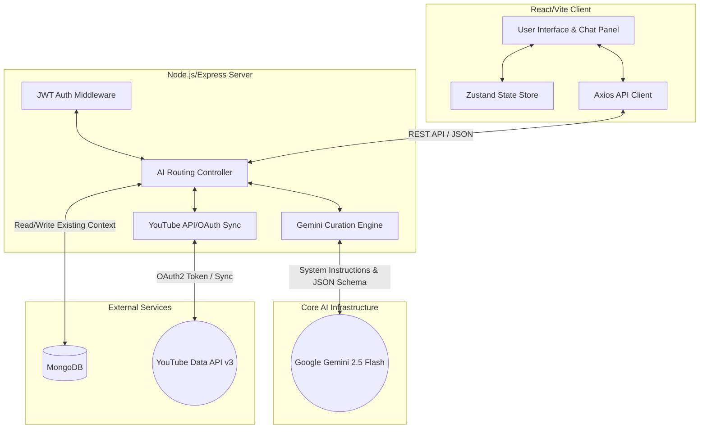

# Harmonia: AI-Powered Multi-Lingual Playlist Manager

## 1. Abstract

Harmonia is an advanced, full-stack web application designed to revolutionize music discovery and playlist management through the integration of cutting-edge Generative Artificial Intelligence. By incorporating Context-Aware AI via Google's Gemini LLM (`gemini-2.5-flash`), the platform enables users to generate highly specific, multi-lingual music playlists using natural conversational prompts. It operates as an intelligent curation bridge, taking a semantically rich prompt, processing it through an LLM with strict response schemas, and directly translating the output into actionable YouTube Data API queries. This allows users to seamlessly push their custom AI-curated playlists directly into their authentic YouTube and YouTube Music ecosystems for immediate playback, solving the friction between music discovery and platform consolidation.

## 2. Problem Statement

Discovering fresh music across varied languages and hyper-specific moods is a tedious, labor-intensive process using the traditional keyword-based search systems provided by major streaming platforms. Furthermore, once listeners discover new tracks globally, manually organizing, collating, and transferring these fragmented discoveries into consolidated, synchronized playlists across devices disrupts the listening experience. Users lack a centralized, conversational tool that can organically curate niche music globally based on abstract concepts (e.g., "moody synthwave for a rainy 2 AM drive") *and* subsequently automate the deployment of that curated list to their preferred streaming endpoint. 

## 3. Architecture Diagram



## 4. Proposed Solution (Emphasis on AI Implementation)

Harmonia solves the curation dilemma by providing an intelligent abstraction layer powered by `@google/genai`. Rather than searching for songs manually, users interact with a natural language chat interface (e.g., *"Give me 20 Lo-Fi tracks for studying across English and Japanese"*).

The core of the application relies on an **Intelligent Pipeline**:

1. **Prompt Contextualization & Deduplication:** 
   Before querying the AI, the backend scans the user's existing MongoDB database to compile an `excludeList`. This list consists of every song the user already has in their playlists. This ensures the AI model operates with contextual awareness of the user's library, actively preventing duplicate recommendations and guaranteeing fresh discoveries.
   
2. **Generative Model Instantiation & Strict Formatting:**
   The backend orchestrates the Google Gemini (`gemini-2.5-flash`) model. To ensure deterministic application behavior from a non-deterministic AI, the backend utilizes rigid **System Instructions** and requests a forced `application/json` response MIME type. The model is commanded to conform strictly to the following JSON schema:
   ```json
   {
     "genre": "Main inferred genre",
     "songs": [{"title": "Song Title", "artist": "Artist Name", "language": "Language"}]
   }
   ```
   
3. **Data Hydration via YouTube API:**
   Once Gemini returns the structured JSON of artists and tracks, the backend loops through the array and automatically constructs precise search query strings (e.g., `Song Title Artist Name audio`). It pings the YouTube Data API v3 to securely fetch the corresponding `videoId` for every AI-suggested track.

4. **Synchronization:**
   The fully hydrated, AI-curated list is saved to the backend database and sent to the frontend, where the user can utilize 1-click OAuth2 synchronization to push the finished playlist natively into their YouTube ecosystem.

## 5. Implementation Tech Stack

**Frontend Architecture:**
- **Core:** React 18, TypeScript, Vite
- **State Management:** Zustand (Immutable global state for reactivity)
- **Styling:** Vanilla CSS3 with dynamic variables and CSS modules
- **Routing:** React Router DOM

**Backend Architecture & AI Implementation:**
- **Framework:** Node.js with Express 5
- **Database:** MongoDB (via Mongoose ORM) for user and context storage
- **Authentication:** JSON Web Tokens (JWT) & Google OAuth2
- **Artificial Intelligence Engine:** `@google/genai` utilizing the **Gemini 2.5 Flash** model for low-latency, highly intelligent prompt evaluations and structured JSON generation.
- **External Communications:** Axios for HTTP request handling towards Google and YouTube APIs

## 6. Screenshots of Implementation

> [!NOTE]
> *Representative screenshots denoting the AI workflow. Provide actual screenshots of your running application locally to finalize this report.*


*Caption: The AI Chat interface mapping a natural language prompt to a strict array of valid musical tracks while preventing duplicates.*


*Caption: The resulting playlist where the AI's pure text suggestions have successfully been hydrated with valid YouTube `videoIds` for playback.*


*Caption: Push mechanism transferring the AI-generated context to a valid YouTube music playlist via OAuth2.*

## 7. Conclusion

Harmonia successfully demonstrates the raw potential of integrating Generative AI as a deterministic engine within conventional software tools. By forcing the `gemini-2.5-flash` model into strict JSON schema compliance and supplying it with real-time user database contexts, the platform transforms abstract musical desires into tangible, programmatic data structures. 

The application offloads the immense burden of cross-platform searching and synchronization to autonomous scripts, allowing users to reclaim their music discovery workflow. The implementation of robust API bridging—from Gemini for human-to-machine curation to YouTube for machine-to-machine execution—proves that modern LLMs can serve as more than just chatbots; they can function as robust, localized data pipeline processors that act seamlessly on behalf of the end-user.
